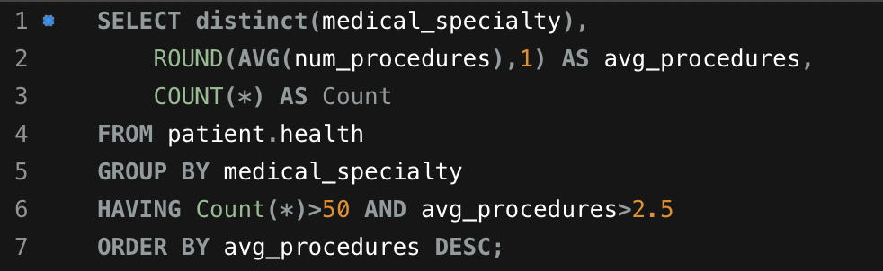
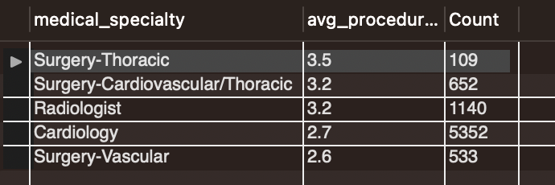
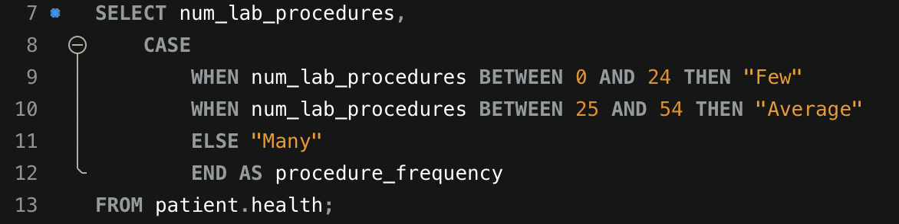
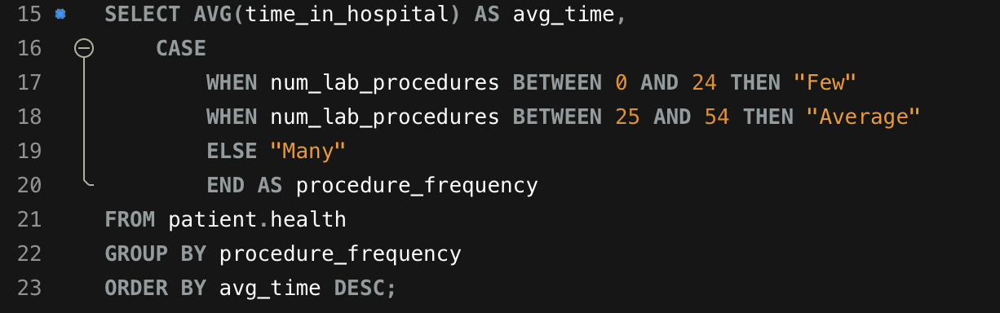

# Healthcare Data Analysis

## Let's Get Started!

As someone who has experience working in the healthcare field, I thought that it would be interesting to analyze some healthcare data. In this project, I used SQL to analyze the data to get some insights into healthcare date. In this project, I focus on getting insight into the following questions:

  - Do the majority of patients stay for less than 7 days at the hospital?
  - Which medical specialties are doing the most number of procedures on average? 
  - Is the hospital treating patients of different races differently? Specifically with the number of lab procedures done?
  - Is there any correlation between the number of days stayed in the hospital to the number of lab procedures orders?
  - List of all patient numbers who are African-America or have a "Up" to metformin.
  - Provide a list of all patients who had an emergency but stayed less than the average time in the hospital.
  - Providing a summary of the top 50 medication patients.

---

## The Data
I used MySQL to analyze healthcare data that ranged between 1998-2008. The dateset can be found on [Kaggle](https://www.kaggle.com/code/iabhishekofficial/prediction-on-hospital-readmission/data?select=diabetic_data.csv).

---

## The Analysis
 
### Do the majority of patient stay for less than 7 days?

The first information that I analyzed was determining whether the majority of patients stay less than 7 days. This is an important factor to help with forcasting for new admissions. I used the SQL statement below to create a histogram for a patients length of stay.

I found that the majority of patients stay at the hospital for less than 7 days, with the most of patients staying for 3 days. 

Having sufficient space available is critical in determining whether a hospital can admit new patients. Determining the average length of a patient's stay can help with forcasting for the capability of new admissions.

### What medical specialties are doing the most number of average procedures?

The next item that I looked at was determining which medical specialties have the highest average number of procedures. Using the SQL statement below, I was able to find that informmation.

The results provide a short list of 5 medical specialties that are most commonly used and have an average number of procedures greater than 2.5.

### The nurse director needs to know if we are subconsciously treating races differently. Show the average number of lab procedures broken down by race.

To do this I used a *JOIN* to combine two tables that share a common column and contain the information that I am looking for. One of the tables contains patient health and treatment information, while the other table contains demographic data. These two tables are related via patient_nbr column that is a unique patient ID number given to every patient.

The results show that the average number of procedures range from 41.82 - 44.46, there is an unknown race, and there does not appear to be a gap between the number of procedures between each race. 

### Is there any correlation between the number of days stayed in the hospital to the number of lab procedures ordered? 

To answer the next question, I first designated a range of values that would be assigned to a patient based on the number of procedures that they had. Lab procedures ranged from:

 - 0-24 as Few
 - 25-54 as Average
 - 55+ as Many
 
I used the SQL statement below to provide the results.

We notice that each patient is assigned as having few, average, or many procedures.

The question that was initially asked was to find the relationship between the number of lab procedures and the time spent in the hospital. I used the following SQL statement to get the that data.

The SQL statement grouped each patients based on their procedure frequency (few, average, or many) and found the average length of stay for patients within those groups. The results show that patients who had longer average stays had more procedures. 

### List of all patient numbers who are African-America or have a "Up" to metformin.

The next item I analyzed required me to use information from two different tabels. Normally, I would use one of the *JOIN* operators to combine the tables with a common primary key and then find the corresponding data. In this case I would need to use *FULL JOIN*  since I am looking to pull patients who are African-American or have "Up" to metformin and FULL JOIN would allow me to combine tables even if there are NULL values in the seccond table. Unfortunately MySQL does not support *FULL JOIN* and I nstead decided to use the *UNION* operator. The UNION operator pulls all data results from the table and stacks the results on top of each other. 

In the statments below, the first SQL statement will provide me with the patient numbers who are African American and the second part of query provides the patient number for patients who have increased their metformin dose.

----image of SQL
----image of results

The list of patients is what was required to search and can then be sent back to research. 

### Provide a list of all patients who had an emergency but stayed less than the average time in the hospital.

The next ask was to provide a list of patients who had an emergengy with admission_type_id of 1 and stayed less than average time in the hospital. As aggregate functions can't be used directly in the WHERE clause, I used a subquery help pull the data. 

-----image of SQL
-----image of results

The results of query provide a list of patients that had an emergnecy and stayed less than average time in th hospital.

Similary, I could have used a CTE to pull the same results. 

-----image of SQL
-----image of results

###Provide a summary for the top 50 medication patients.

Lastly, I created a summary of the top 50 patients who who were using the most medications. Patients were sorted based on highest number of medications they had. Patients who had the same amount of medications were then sorted by number of lab procedures.

-----image of SQL
-----image of results

---

## Results and Recommendation

---

***I appreciate you making it to the end of the article. Feel free to connect with me on [LinkedIn](https://www.linkedin.com/in/jbespinoza/).***
