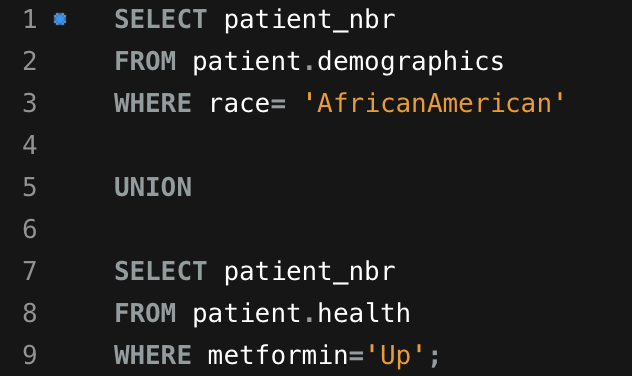
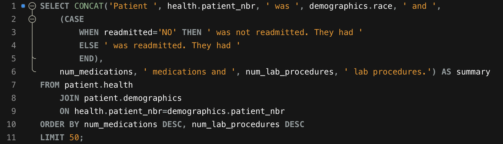
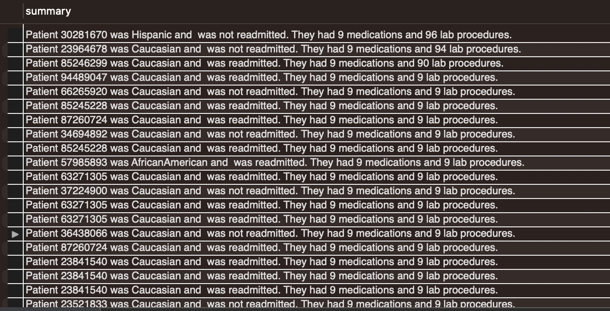

# Healthcare Data Analysis

## Let's Get Started!

As someone who has experience in the healthcare field, I thought that it would be interesting to analyze some healthcare data. In this project, I used SQL to analyze healthcare data and focused on getting insights into the following questions:

  - Do the majority of patients stay in the hospital for less than 7 days?
  - Which medical specialties are doing the most average number of procedures? 
  - Is the hospital treating patients of different races differently? Specifically with the number of lab procedures done?
  - Is there any correlation between the number of days stayed in the hospital and the number of lab procedures?
  - Provide a list of all patient numbers who are African-America or have a "Up" to metformin.
  - Provide a list of all patients who had an emergency but stayed less than the average time in the hospital.
  - Provide a summary of the top 50 medication patients.

---

## The Data
I used MySQL to analyze healthcare data that ranged between 1998-2008. The dateset can be found on [Kaggle](https://www.kaggle.com/code/iabhishekofficial/prediction-on-hospital-readmission/data?select=diabetic_data.csv).

---

## The Analysis
 
### Do the majority of patient stay for less than 7 days?

The first qustion to answer was to determine whether the majority of patients stay less than 7 days. This is an important factor to help with forecasting for the availability for new admissions. I used the SQL statement below to create a histogram for a patients length of stay.

I found that the majority of patients stayed at the hospital for less than 7 days, with the most of patients staying for 3 days. 

Having sufficient space available is critical in determining whether a hospital can admit new patients. Determining the average length of a patient's stay can help with forecasting for the capability of new admissions.

### What medical specialties are doing the most number of average procedures?

The next item that I looked at was determining which medical specialties have the highest average number of procedures. Using the SQL statement below, I was able to find that informmation.

The results provide a short list of 5 medical specialties that are most commonly used and have an average number of procedures greater than 2.5.

### Is the hospital treating patients of different races differently? Specifically with the number of lab procedures done?

To answer this question, I used a *JOIN* to combine two tables that share a common column and contain the information that I am looking for. One of the tables contains patient health and treatment information, while the other table contains demographic data. These two tables are related via patient_nbr column that is a unique patient ID number given to every patient.

The results show that the average number of procedures range from 41.82 - 44.46, there is an unknown race (most likely not documented/recorded), and there does not appear to be a gap between the number of procedures between each race as the average number of procedures are similar. 

### Is there any correlation between the number of days stayed in the hospital to the number of lab procedures ordered? 

To answer the next question, I first assgined a category patients based on the number of procedures that they had. Lab procedures ranged from:

 - 0-24 as Few
 - 25-54 as Average
 - 55+ as Many
 
I used the SQL statement below to provide the results.

We notice that each patient is assigned as having few, average, or many procedures.

The question that was initially asked was to find the relationship between the number of lab procedures and the time spent in the hospital. I modified the existing SQL statement to get that data.

The SQL statement grouped each patients based on their procedure frequency (few, average, or many) and found the average length of stay for patients within those groups. The results show that patients who had longer average stays had more procedures. 

### List of all patient numbers who are African-American or have a "Up" to metformin.

The next item was to provide a list of patients that are African-American or have a "Up" to metformin. Similar to the previous questions, I needed information from two tables. Normally I would use *FULL JOIN* to pull information that satisfied my requirements of demographics and health data. *FULL JOIN* would combine both tables and not exclude rows that have NULL values. Unfortunately MySQL does not support *FULL JOIN* and instead decided to use the *UNION* operator. The *UNION* operator pulls all data results from the table and stacks the results on top of each other. 

The SQL statement above provided the patient numbers for those who are African American and patients who have "Up" for their metformin dose.

### Provide a list of all patients who had an emergency but stayed less than the average time in the hospital.

The next ask was to provide a list of patients who had an emergengy with admission_type_id of 1 and stayed less than average time in the hospital. As aggregate functions can't be used directly in the WHERE clause, I used a subquery to pull the data. 

The results of query provide a list of patients that had an emergnecy and stayed less than the average time in the hospital.

Similary, I could have used a CTE to pull the same results. 

### Provide a summary for the top 50 medication patients.

Lastly, I created a summary of the top 50 patients who who were using the most medications. Patients were sorted based on highest number of medications they had. Patients who had the same amount of medications were then sorted by number of lab procedures.

---

## Results and Recommendation

Using SQL, I was able to find interesting insights to the healthcare data. I found that the average patient stay is less than 7 days with most patients staying an average of 3 days; there are 5 medical specialties that are doing most number of the procedures on average; there does not appear to be a difference in the way that different races are treated; and there appears to be a relationship between the average length of a patient's stay and the number of procedures that they receive. In addition, I was able to create a list of patients who are African-American or have a "Up" to metformin; a list of patients who had an emergency but stayed less than the average time in the hospital; and a summary of the top 50 medication patients.

---

***I appreciate you making it to the end of the article. Feel free to connect with me on [LinkedIn](https://www.linkedin.com/in/jbespinoza/).***
