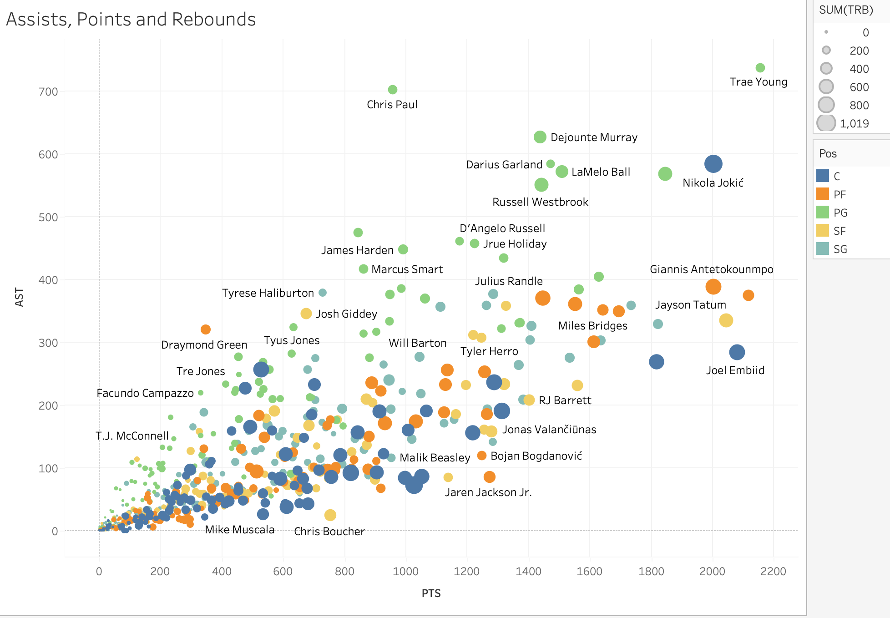
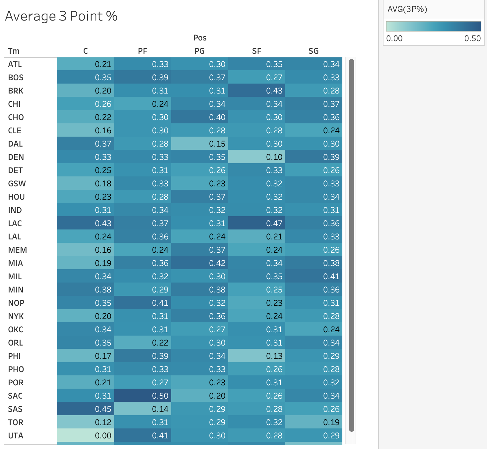
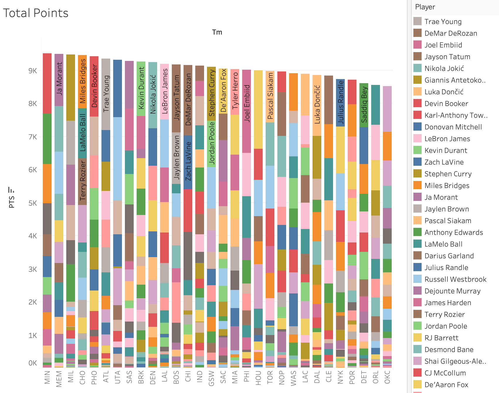
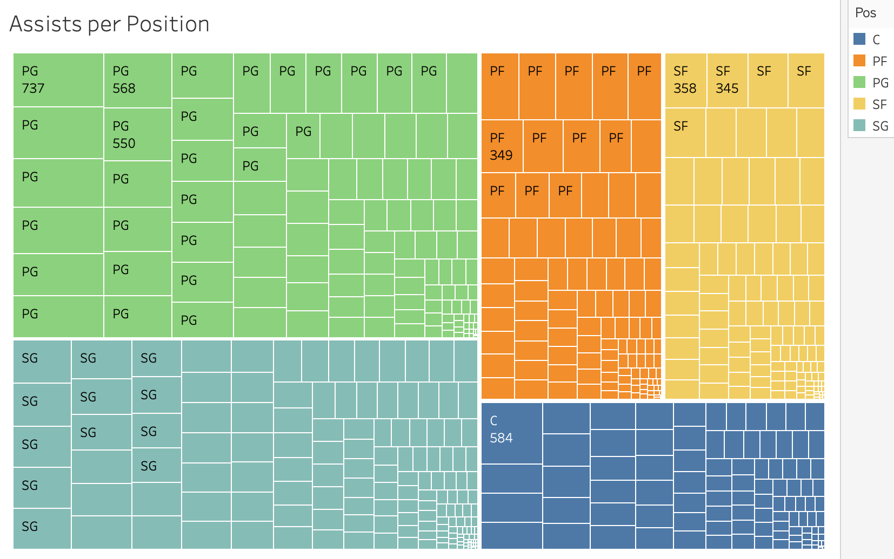

# NBA Analysis

## Let's Get Started!

As someone who has experience in the healthcare field, I thought that it would be interesting to analyze some healthcare data. In this project, I used SQL to analyze healthcare data and focused on getting insights into the following questions:

  - Do the majority of patients stay in the hospital for less than 7 days?

---

## The Data
I used [Tableau](https://public.tableau.com/app/profile/julio.espinoza/viz/21-22NBAAnalysis/21-22NBAAnalysis) to analyze 21-22 NBA data and the dateset can be found [here](https://www.basketball-reference.com/leagues/NBA_2022_totals.html).

---

## The Analysis
 
### NBA players performance on total points, total assists, & total rebounds. 

The first item I analyzed was the NBA players total points, assists and rebounds. I created a bubble plot that measures all three points of interest with assists and points being measured in the graph, rebounds measured by the size of the data point, and each color representing different player positions. 

We notice that point guards have the highest points and assists while centers have the lowest. We also notice a Nikola Jokic is an outlier having greater than usual rebounds, assists, and points compared to other players in his position as a center. 

### What position was the most efficient at shooting 3-pointers for every team.

The next item that I looked at was finding which position was the most efficient at shooting 3-pointers for every team. To easily view this data, I created a table that identifies the average 3 point % for each position in each team.

The results show that the power forward from the Sacramento Kings had the highest average 3 point % with 50%. 

### Break down the total points scored by each team and players.

I next analyzed the total points scored by each player per team by using a stacked bar chart. 

The results show that the Minnesota Timberwolves had the highest total points scored with Karl-Anthony Towns scoring the most within the team with 1,818 points. After further analysis, Trae Young from the Atlanta Hawks is the player that had the highest amount of points scored with 2,155 

### Players with the most assists per position.

The last item to analyze was identifyng the number of assists for each position and player. The treemap below is divided into five colors with each color designated for a different position and each color subdivided for each player.

The tree map is divided into five colors, each representing a player position. From the data, we can see that Trae Young, a point guard, had the highest number of turnovers in the season. However, as we previously noted from the bubble chart, Trae Young also had the highest total points and assists.

The treemap shows that point guards have the highet assists with Trae Young having the highest number of assists.

---

## Results and Recommendation

---

***I appreciate you making it to the end of the article. Feel free to connect with me on [LinkedIn](https://www.linkedin.com/in/jbespinoza/).***
