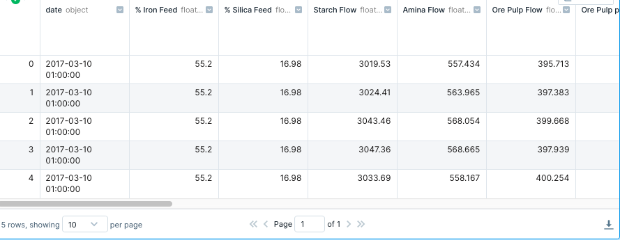
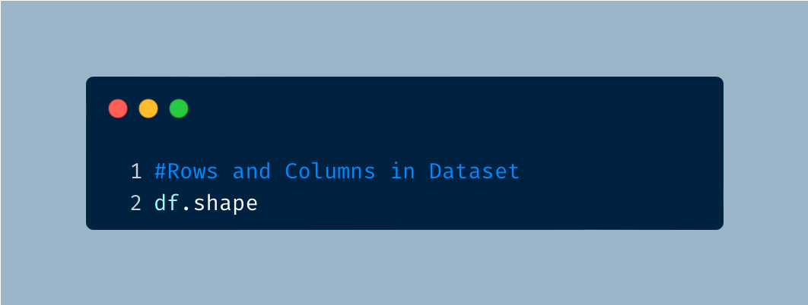
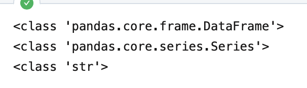
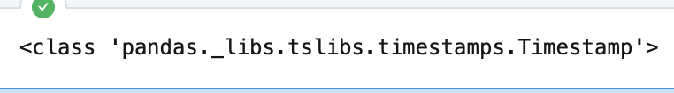
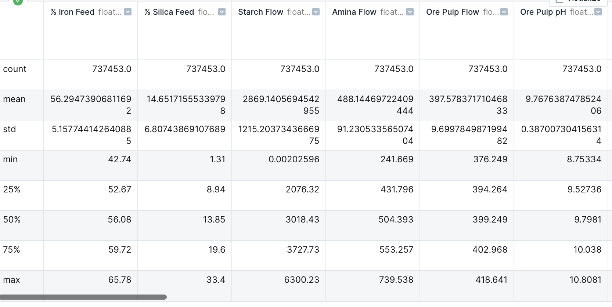

# How Pure is Pure? Purifying Iron from Dirty Data

## Let's Get Started!

Picture this: You are out in the field and collect a sample of dirt but you are curious to know how much of your sample contains iron? You start to think about ways to separate iron from other impurities of the sample and then remember an article that discussed this process. The answer? **froth flotation**. In the mining industry, froth flotation is a process used to purify minerals from unwanted materials. This process involves mixing the sample in an aqueous solution and then coating the mineral with a coating agent that makes them repefll water. The mixture is then injected with air bubbles that causes the material of interest (the one with the coating agent) to float towards the top and creates a froth. The froth can be then separated from the rest of the material.  

In this analysis, I examine the % Iron Concentrare from a flotation plant to determine the purity of the iron sample. In my analysis, I found that

  - Point guards generally have the highest points and assists, and Nikola Jokic is an outlier with having higher assists, rebounds and points compared to other center's.
  - The power forward position from the Sacramento Kings had a 50% 3 pointer average, the highest average out of all of the teams.
  - The Minnesota Timberwolves had the highest total points scored and Trae Young from the Atlanta Hawks had the highest amount of points scored.
  - Point guards have the highest number of assists with Trae Young having the highest number of assists.

---

## The Data
I used Deepnote, a browser IDE (Interactive Development Environment) that allows the use of Python, to analyze mining information from March 2017 to September 2017. The dateset can be found on [Kaggle](https://www.kaggle.com/datasets/edumagalhaes/quality-prediction-in-a-mining-process?resource=download).

---

## The Analysis
 
### Installing and Importing the Libraries 

Before I could start analyzing my the data, I had to first upload my CSV file to Deepnote, then install and import the libraries that I was going to use. To install and import the libraries, I used the following code:

 

I used Pandas for data manipulation, Seaborn and Matplotlib for data visualization.

### Connecting the Data

The next move was to connect python to the actual data. I used a dataframe to read the CSV file using Pandas and then preview the first couple of lines of the data.

 

 

### Basic Analysis and Cleanup

For an initial anlysis of the data, I am curious to know how many rows and columns of data we have. 

 

 

I find that there are 737,453 rows and 24 columns in this dataset.

In an earlier preview of the data, I find that a date column is provided. When dates are provided, I usually find that they are not properly imported and require changing it to the correct variable type. I used the following code to first check the variable type for the date column. 

 
 

As expected, the variable type for date will need to be adjusted.

 

We can use the following code to confirm that the data type has changed.

 
 

### Descriptive Analytics

Now that the data is ready for further analysis, I first retrieve a statistical summary for each of the columns.

 
 

#Our boss says something weird happened on June 1, 2017 & wants us to investigate. 

---

## Results

There is a lot of data that can be gathered from basketball data. I analyzed the data to gain some insights to the NBA 21-22 season and I found that: point guards score the most and have the most assists, with Nikola Jokic as an outlier having higher assists, rebounds and points compared to other center's; the power forward position from the Sacramento Kings had a 50% average for 3 pointers; the Minnesota Timberwolves had the highest total points scored and Trae Young from the Atlanta Hawks is the player that scored the most; and point guards have the highest number of assists with Trae Young having the highest number of assists.

---

***I appreciate you making it to the end of the article. Feel free to connect with me on [LinkedIn](https://www.linkedin.com/in/jbespinoza/).***
