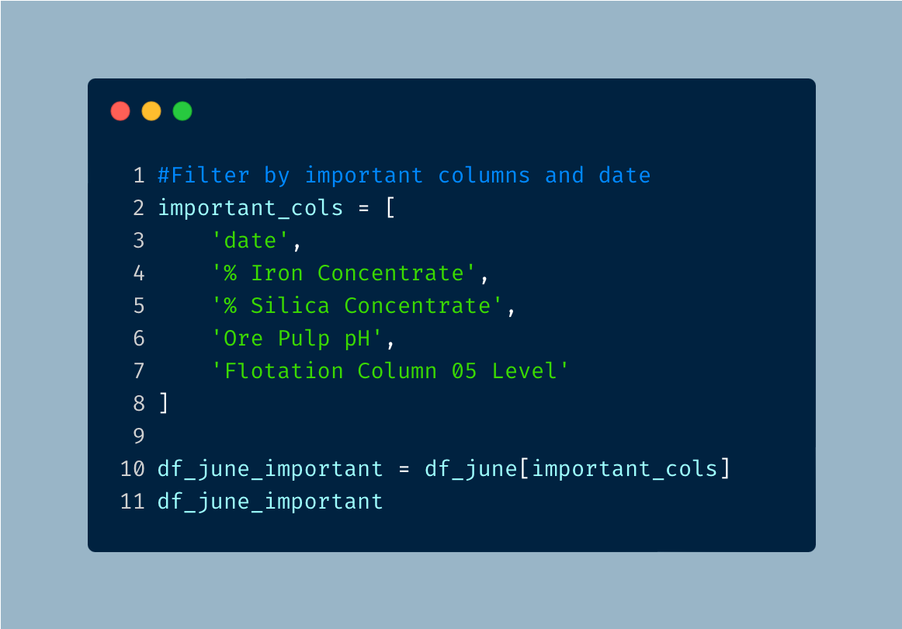
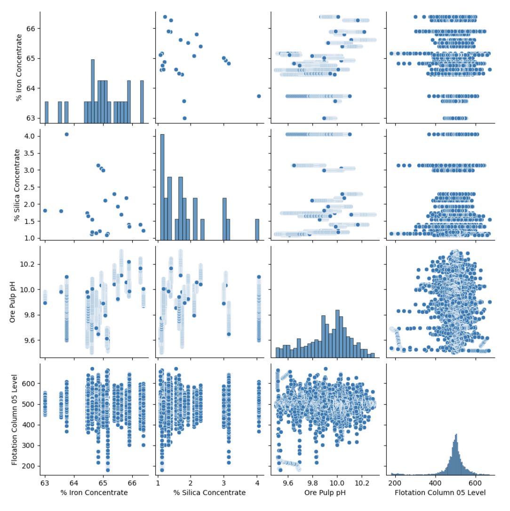
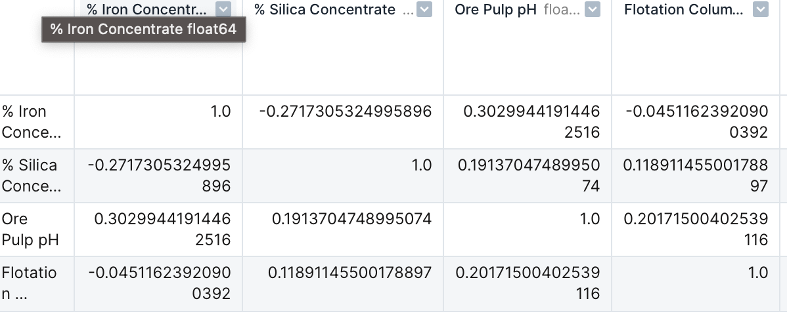
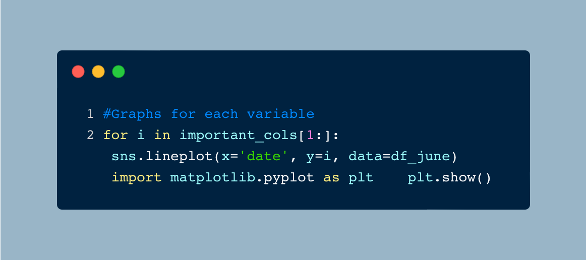
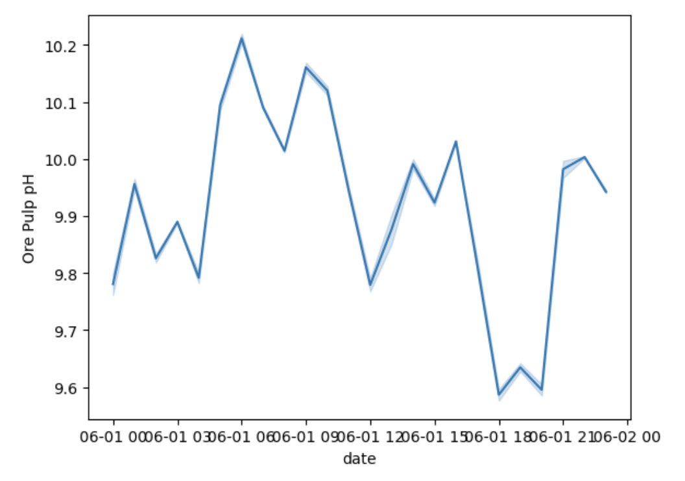

# How Pure is Pure? Purifying Iron from Dirty Data

## Let's Get Started!

Picture this: You are out in the field and collect a sample of dirt but you are curious to know how much of your sample contains iron? You start to think about ways to separate iron from other impurities of the sample and then remember an article that discussed this process. The answer? **froth flotation**. 

In the mining industry, froth flotation is a process used to purify minerals from unwanted materials. This process involves mixing the sample in an aqueous solution and then coating the mineral with a coating agent that makes them repell water. The mixture is then injected with air bubbles that causes the material of interest (the one with the coating agent) to float towards the top and creates a froth. The froth is then separated from the rest of the material.  

In this analysis, I examine the % Iron Concentrare from a flotation plant to determine the purity of the iron sample. In my analysis, I found that

  - There is no relationship visually seen between each variables when looking at scatterplots and this is verified with the correlation coefficient.
  - There is a low negative correlation between % iron concentrate and % silica concentrate on June 1, 2017.
  - Someting odd happended with the float column levels on June 1, 2017 at 1800. 

---

## The Data
I used Deepnote, a browser IDE (Interactive Development Environment) that allows the use of Python, to analyze mining information from March 2017 to September 2017. The dateset can be found on [Kaggle](https://www.kaggle.com/datasets/edumagalhaes/quality-prediction-in-a-mining-process?resource=download).

---

## The Analysis
 
### Installing and Importing the Libraries 

Before I could start analyzing my the data, I had to first upload my CSV file to Deepnote, then install and import the libraries that I was going to use. To install and import the libraries, I used the following code:

 

I used Pandas for data manipulation, Seaborn and Matplotlib for data visualization.

### Connecting the Data

The next move was to connect python to the actual data. I used a dataframe to read the CSV file using Pandas and then preview the first couple of lines of the data.

 

 

### Basic Analysis and Cleanup

For an initial analysis of the data, I am curious to know how many rows and columns of data we have. 

 

 

I find that there are 737,453 rows and 24 columns in this dataset.

In an earlier preview of the data, I find that a date column is provided. When dates are provided, I usually find that they are not properly imported and require changing it to the correct variable type. I used the following code to first check the variable type for the date column. 

 
 

As expected, the variable type for date will need to be adjusted.

 

We can use the following code to confirm that the data type has changed.

 
 

### Descriptive Analytics

Now that the data is ready for further analysis, I first retrieved a statistical summary for each of the columns.

 
 

We are asked to take a closer look at the data from June 1, 2017 and focus on specific columns. I start by first narrowing the data to the specific date.

 
 

Now we can filter for the specific columns. 

 
 

This data doesn't tell us much, but I can now use the filtered data to find out how this data relates to each other. I created the following scatterplot with Seaborn to see how the data relates.

 
 

I don't see any relation between any of the variables. Normally, I would want to see some sort of shape, but I don't see anything that stands out. To confirm whether there is a relation, I created a correlation matrix.

 
 

Again I notice that the correlation between each variable is very low. Correlations range from -1 to 1 and a number that is close to either end means that theres is a strong correlation. 

This is odd to see because we should expect to see the % Iron Concentrate to have a strong negative correlation with % Silica Concentrate. As iron is separated and purified from the other elements, the % Silica Concentrate measured from the iron sample should decrease. Although the correlation matrix shows a negative value, indicating a negative correlation, the correlation coefficient is not significant to show that there is a strong correlation between the variables.

The last thing was to create a line plot for each of the important variables using a for loop to see how the variables change throughout the day. The for loop allows me to repeat a set of intstructions until the set is complete.

 
 
 
 
 

As expected, we see that as iron concentrate increases, silica concentrate decreases. We also see that all of the variables vary throughout the day. Something that does stand out is the float column 05 level takes a huge dip at 1800 when the levels are otherwise consistent. Float column level provides the froth level (measured in mm) in the flotation cell and measures the thickness of the floats. 

As float column values decrease, we see a decrease in the other variables since there is less of a final product being produced. Something must have happened at 1800 that affected the float column and should be further investigated.

---

## Results

In this analysis, I find that there is little to no relationship between each variable as shown with scatterlots and correlation coefficient for the data on June 1, 2017. I also find that there is a low negative correlation between % iron concentrate and % silica concentrate. This is odd to see because we would expect to see a strong negative correlation between these two variables. As % iron concentrate increases, we should expect to see a decrease in % silica concentrate. I also find that something odd happened with the float column levels on June 1, 2017 at 1800. Further analysis should be done to determine what happened during this time. 

---

***I appreciate you making it to the end of the article. Feel free to connect with me on [LinkedIn](https://www.linkedin.com/in/jbespinoza/).***
