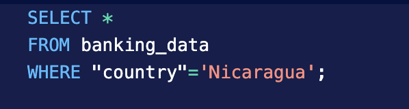
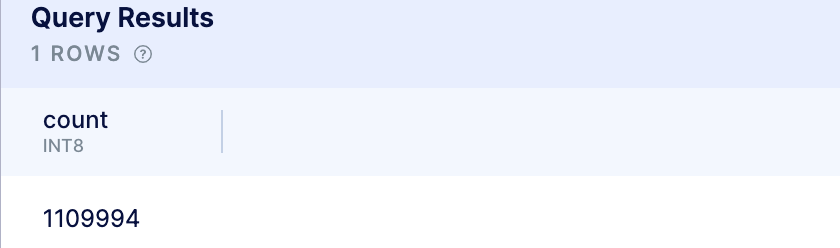
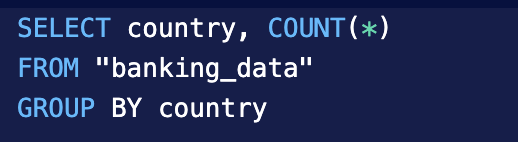
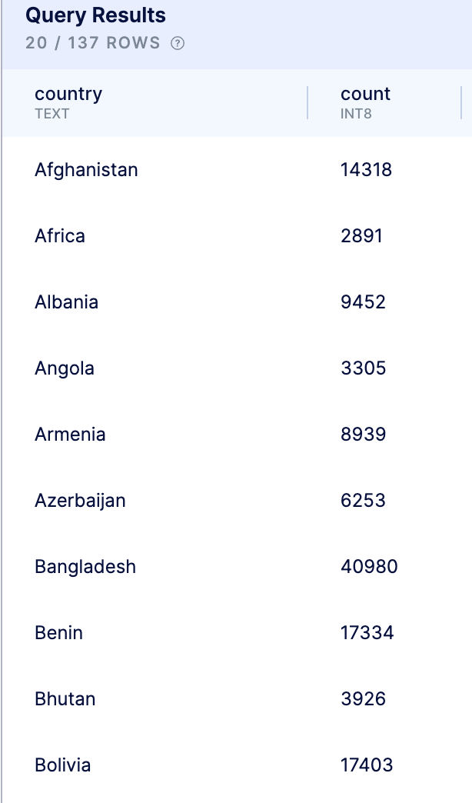
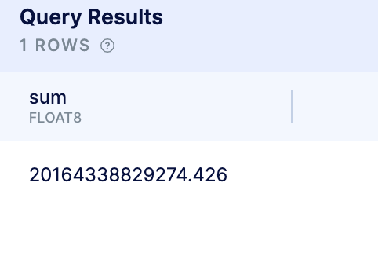
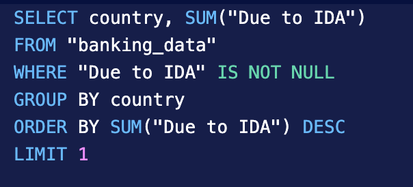
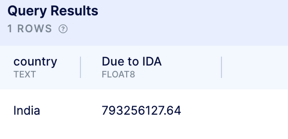
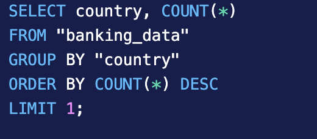
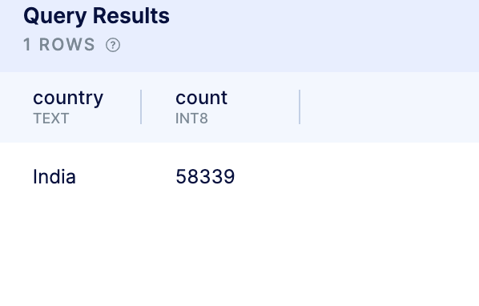

# How Much Money Does the World Owe?

## Let's Get Started!

Money, money, money makes the world go round. In this project I analyze the [International Development Association's](https://ida.worldbank.org/en/what-is-ida) (IDA) loans data to provide some insight for a stakeholder. The IDA is part of the World Bank and provides low interest loans to poor countries to help reduce poverty.

The stakeholder was interested in specific information from the dataset. During my analysis, I find that: 

  - there are 13,704 transactions from Nicaragua
  - There is a total of 1,109,994 transactions
  - that each country had several transactions with varying loan amounts
  - $20,164,338,829,274.426 is currently owed to the IDA.
  - India has 58,339 loans with a current total of $3,347,798,404,996.19

---

## The Data

The dataset was provided as a [CSV](https://finances.worldbank.org/Loans-and-Credits/IDA-Statement-Of-Credits-and-Grants-Historical-Dat/tdwh-3krx) file that consists of 1,109,994 rows, and SQL was used for analysis.

---

## The Analysis

### Show us all transactions from the Nicaragua (the country)

The stakeholder was first interested in finding all the transactions from Nicaragua. Using the SQL statement below, I was able to pull all transactions that were from Nicaragua. 

I find that there was a total of 13,704 transactions that are from Nicaragua.

### How many total transactions? 

The next item of interest was finding the total transactions to date under the IDA. 

I find that there was a total of 1,109,994 transactions to date within that file.

### How many total transactions per country?? 

The stakeholder was then interested in narrowing down the data and finding the total transactions made per country.

I find that there was 137 countries involved and the SQL results provide the number of transactions in the *count* column.

### What is the max owed to the IDA?

The next area of interest was finding the total amount that is owed to the IDA

We find that the total owed is $20,164,338,829,274.426.

I also looked into which country owed the most and find that India owed the most for a total of $3,347,798,404,996.19

### Which country was the most recent to pay?

The next questions that was asked to analyze was determining which country most recently made a payment. Unfortunately, that data was not provided ont he CSV file. At that point in the process, I would reach out to the stakeholder to determine if there are other data sources  that contain that information. If there are other tables, I would simply use a JOIN clause to join both tables together and find the corresponding information. 

### Which country has the most loans? 

The last thing that I looked at was determining which country had the most loans.

The results show that India had the most amount of loans at 58,339.

---

## Results

There was several types of information that the stakeholder was interested in learning from the data. Throughout my analysis, I found that Nicaragua has a total of 13,704 transactions, there is a total of 1,109,994 transactions from all countries, each country varied in the amount loanded to them, the total owed back to the IDA is $20,164,338,829,274.426 and India borrowed the most loans and also holds the highest current total $3,347,798,404,996.19 that is due to the IDA.

---

***I appreciate you making it to the end of the article. Feel free to connect with me on LinkedIn.***
