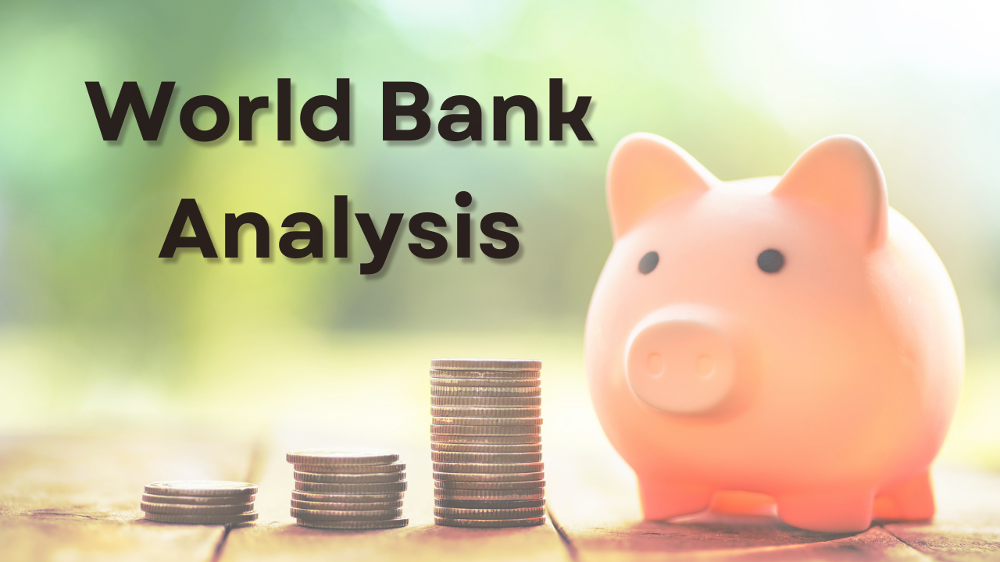

# My Data Analytics Portfolio
--
## [How Pure is Pure? Purifying Date from Dirty Data](/Python_Engineering_Project.md)

In this project I used Python to analyze mining data to gain insight in the production of iron from a froth flotation process.

---
## [NBA 21-22 Season Analysis](/NBA_Analysis.md)

In this project I used Tableau to analyze and gain insights to the NBA 21-22 season data. Feel free to take a look and let me know what you think!

---
## [Healthcare Data Analysis](/Healthcare_Analysis.md)

In this project I used MySQL to analyze and gain insights to healthcare data. Feel free to take a look and let me know what you think!

---
## [How Much Money Does the World Owe?](/SQL_Banking_Project.md)

In this project I take a look at the International Development Association (IDA), part of the World Bank, dataset using SQL to analyze different KPIs requested by the stakeholder. Check it out and let me know what you think!

---
## [Massachusetts Education System May Be Doomed](/Massachusetts_School_Analysis.md)

Check out this article about my analysis of the Massachusetts education system using Tableau. We dive into different KPI's that affect college attendance.

---
## [DoorDash Marketing Analytics](https://www.linkedin.com/pulse/doordash-marketing-analysis-julio-espinoza/)

DoorDash analysis to learn about their sales and how marketing campaigns affect their sales.

---
